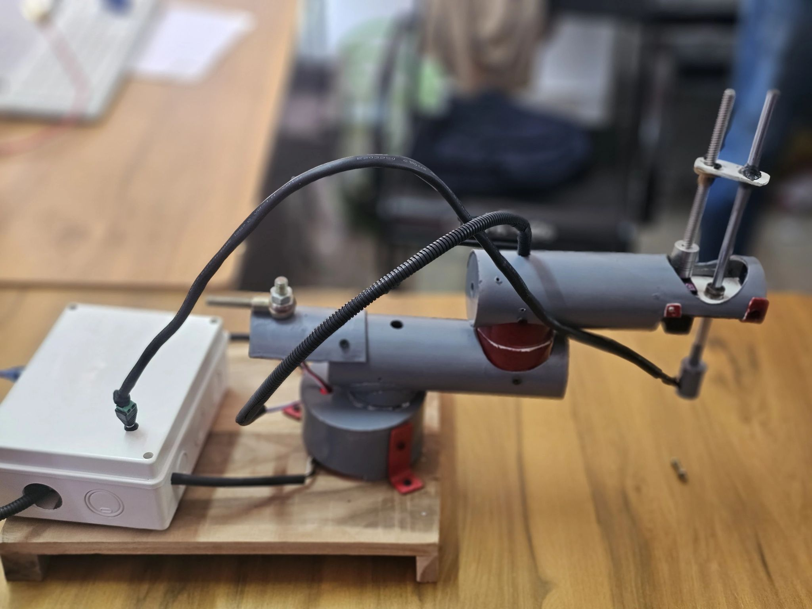
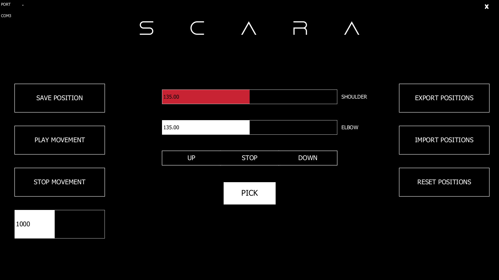
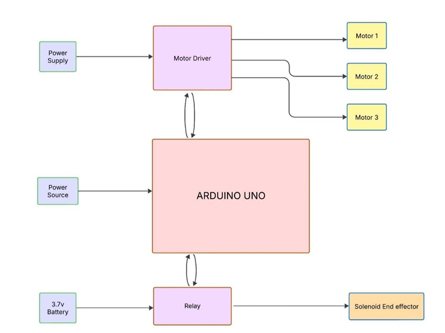

# SCARA Robotic Arm with GUI Control System
> Real-time joint control and forward kinematics display via Processing GUI — PCA9685 + Arduino

[]([https://youtu.be/cPyBFfTFSc4](https://youtube.com/shorts/6R_z6v3E24E))
[](https://github.com/suhaidpk)

---


<!-- Add a real photo of your physical arm here -->

---

## What This Does

A SCARA (Selective Compliance Assembly Robot Arm) built for pick-and-place tasks.
Controlled via a custom **Processing (Java) GUI** that provides real-time joint control,
live forward kinematics display, and repeatable motion sequences — all communicated
over serial to an **Arduino** driving servos through a **PCA9685 PWM driver**.

No hardcoded positions. No pre-scripted motions. Every joint is live, every
position is recordable, every sequence is replayable.

---

## GUI Screenshot


<!-- Strongly recommended: add a screenshot of your Processing GUI here.
     It immediately shows recruiters what you built. -->

---

## System Architecture



## Hardware

| Component | Details |
|---|---|
| Arm type | SCARA (2 rotational + 1 linear Z-axis) |
| PWM Driver | PCA9685 (I²C, 16-channel) |
| Shoulder | Digital servo — PWM channel 0 |
| Elbow | Digital servo — PWM channel 1 |
| Z-axis | MG996R continuous rotation servo — PWM channel 2 |
| Gripper | Solenoid / servo — Arduino digital pin 9 |
| Controller | Arduino Uno / Mega |
| Joint range | 0° – 270° (shoulder & elbow) |
| Arm lengths | Upper arm: 100 mm · Forearm: 100 mm (adjustable in code) |
| Power | External 5V–6V supply for servos |

---

## Software Stack

| Layer | Technology |
|---|---|
| GUI | Processing 4.x (Java) |
| GUI libraries | ControlP5, G4P Controls |
| Low-level control | Arduino IDE |
| Serial communication | Processing `Serial` ↔ Arduino `Serial` at 9600 baud |
| Kinematics | 2-DOF forward kinematics (computed in Processing) |

---

## GUI Features

- **Shoulder & Elbow sliders** — real-time joint control (0°–270°)
- **Live forward kinematics display** — shows end-effector (X, Y) in mm as you move the sliders
- **Lead screw Z-axis** — UP / STOP / DOWN buttons with visual feedback
- **Gripper toggle** — PICK / RELEASE with colour-coded button state
- **Movement recording** — save any number of joint positions as waypoints
- **Smooth playback** — interpolates between waypoints with configurable speed (200–2000 ms)
- **Import / Export** — save and load position sequences as `.txt` files
- **Serial port selector** — hot-swap COM ports from the GUI without restarting
- **Fullscreen layout** — scales dynamically to any display resolution

---

## Serial Communication Protocol

The GUI sends plain-text commands over serial at **9600 baud**:

| Command | Action |
|---|---|
| `1 <angle>\n` | Set shoulder to angle (0–270°) |
| `2 <angle>\n` | Set elbow to angle (0–270°) |
| `3 1\n` | Lead screw UP |
| `3 0\n` | Lead screw STOP |
| `3 -1\n` | Lead screw DOWN |
| `4 1\n` | Gripper CLOSE (pick) |
| `4 0\n` | Gripper OPEN (release) |

---

## How It Works

1. Operator drags joint sliders in the Processing GUI
2. GUI sends a serial command to Arduino on every slider change
3. Arduino parses the command and writes the mapped PWM value to the PCA9685
4. PCA9685 drives the corresponding servo to the target angle
5. GUI simultaneously computes and displays the end-effector (X, Y) position via forward kinematics
6. Operator records positions as waypoints; playback interpolates between them smoothly

---

## Pick-and-Place Sequence

```
Home position → Rotate shoulder + elbow to object
→ Lower Z axis (lead screw DOWN)
→ Gripper PICK
→ Raise Z axis (lead screw UP)
→ Rotate to drop target
→ Lower Z axis
→ Gripper RELEASE
→ Raise Z axis → Return home
```


<!-- Record a 5–10 second phone video of the arm doing this and convert to GIF
     at ezgif.com — it plays automatically on GitHub and is very impressive -->

---

## Results

- Positioning repeatability: ±[ ] mm
- Pick-and-place cycle time: [ ] seconds
- Consecutive error-free cycles tested: [ ]
- Smooth interpolation across [ ] saved waypoints

<!-- Fill in your actual measured numbers — even rough values are better than blanks -->

---

## Challenges & How I Solved Them

**1. GUI sending commands on every frame causing serial flooding**
→ Commands are only sent on slider change events (`onChange` callback), not in the `draw()` loop — keeping serial traffic minimal and Arduino responsive.

**2. Playback blocking the GUI thread**
→ Playback runs in a separate Java `Thread`, keeping the Processing GUI fully interactive while the arm executes the motion sequence.

**3. Lead screw continuous servo not stopping cleanly**
→ Identified that `LEAD_STOP = 0` (zero PWM) doesn't produce a proper neutral pulse. Changed to `300` (~1.5 ms pulse) to reliably stop the MG996R.

**4. [Add one more real challenge you faced during the build]**
→ [How you fixed it]

---

## Repository Structure

```
scara-arm-gui-control/
├── GUI/
│   └── SCARA_GUI/
│       ├── SCARA_GUI.pde       # Processing sketch — main GUI
│       └── data/
│           └── Dune_Rise.ttf   # Custom font (required)
├── Arduino/
│   └── SCARA_Arduino/
│       └── SCARA_Arduino.ino   # Arduino firmware
├── positions/                  # Exported position sequence files (.txt)
├── images/
│   ├── scara_arm.jpg
│   ├── gui_screenshot.png
│   └── pick_place.gif
├── .gitignore
└── README.md
```

---

## Setup & Installation

### 1. Upload Arduino Firmware

1. Open `Arduino/SCARA_Arduino/SCARA_Arduino.ino` in the Arduino IDE.
2. Install required library: **Adafruit PWM Servo Driver** via Tools → Manage Libraries.
3. Select your board and port, then click **Upload**.

### 2. Calibrate Servo Pulse Ranges

Edit these constants in `SCARA_Arduino.ino` to match your servos:

```cpp
const int SHOULDER_MIN = 85;    // Pulse count at 0°
const int SHOULDER_MAX = 655;   // Pulse count at 270°
const int ELBOW_MIN    = 150;   // Pulse count at 0°
const int ELBOW_MAX    = 600;   // Pulse count at 270°
const int LEAD_STOP    = 300;   // Neutral pulse (~1.5 ms) for MG996R
```

### 3. Run the Processing GUI

1. Install [Processing 4.x](https://processing.org/download).
2. Install libraries via **Sketch → Import Library → Manage Libraries**:
   - `ControlP5` by Andreas Schlegel
   - `G4P` by Peter Lager
3. Copy `Dune_Rise.ttf` into `GUI/SCARA_GUI/data/`.
4. Open `GUI/SCARA_GUI/SCARA_GUI.pde` and click **Run** (▶).
5. Select the correct serial port from the **PORT** dropdown (top-left).

### 4. Adjust Arm Dimensions

In `SCARA_GUI.pde`, update to match your physical arm:

```java
float upperArmLength = 100.0;   // Shoulder-to-elbow in mm
float forearmLength  = 100.0;   // Elbow-to-gripper in mm
```

---

## What I Learned

- Designing a real-time GUI that stays responsive during continuous serial communication using Java threads
- Implementing 2-DOF forward kinematics to display live end-effector position
- Driving multiple servo types (positional + continuous rotation) from one PCA9685 over I²C
- Structuring motion playback with smooth interpolation between recorded waypoints

---

## About

Built as part of B.Tech — Robotics & AI Engineering
Rajiv Gandhi Institute of Technology, Kottayam, Kerala | 2023–2024

**Muhammed Suhaid P K**
[pksuhaid@gmail.com](mailto:pksuhaid@gmail.com) |
[LinkedIn](https://linkedin.com/in/suhaid-pk4) |
[GitHub](https://github.com/suhaidpk)
